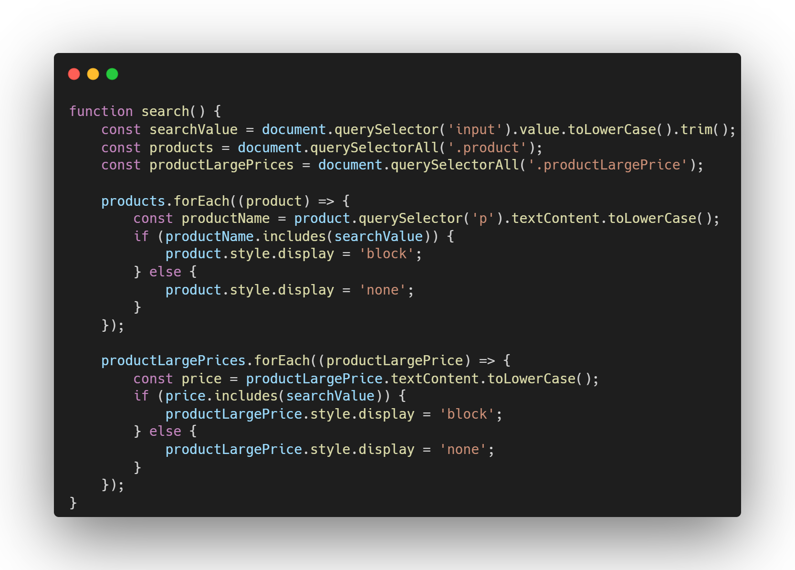

<h1>Online store website written in pure JavaScript</h1>
<h3>The site code uses many filters and a product search system, the code of which is presented below:</h3>
 
 
<h3>It was also decided to write a filtering method by price range without using third-party libraries, the point is that I created two input tags and flipped one of them 180 degrees:</h3>

<h3>in the fun function I set the dollars variable to -600 to the existing value of the configured user range so that the value becomes 100, since before that I flipped the input tag 180 degrees:</h3>

 
<h3>You can see and try the final result using the link:</h3>

Link:

<a href="https://shopco-exportqq.netlify.app/" style="font-size:18px;float: left">https://shopco-exportqq.netlify.app/</a>
